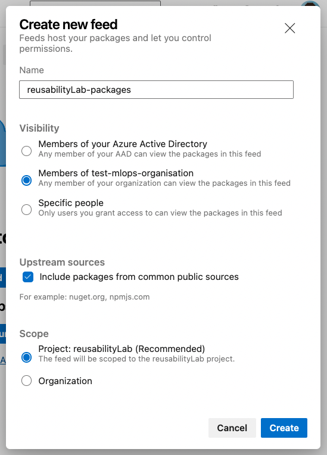

[[_TOC_]]
# Packaging reusable code- Azure DevOps

**How do you package reusable code in a private pypi repository**

Large projects especially those with high collaborative teams often have code that is reusable across teams. Packaging this code makes the code’s functionality easily available, version-controlled and maintainable. Instead of the different teams reinventing the wheel, they can utilise the standardised implementation of the reusable functionality. 

Public package index repositories like PyPI and [conda-forge](https://conda-forge.org/) exist to host the popular packages like pandas, numpy etc but for certain projects, code has to be private. This blog explores how we package and publish reusable code in a private pypi repository.  We shall use Azure DevOps and Python package for this demonstration. *Similar foundational concepts apply to other git hosts and programming languages*

## Prerequisites

1. Azure DevOps Repository - see how to create one
2

## Steps
### 1. Configure Artifact Feed
Azure Artifacts feed enables you to store, manage and control how your packages are shared. The feed can be project or organizational wide accessible. 

1. Create a new feed in Azure Artifacts -in our case, the name is `reusabilityLab-packages`. Multiple settings exist including setting the visibility and scope of access.  See image below:

    

For more information about Azure artifact feeds, follow this [link](https://learn.microsoft.com/en-us/azure/devops/artifacts/concepts/feeds?view=azure-devops)


### 2. Setup Folder structure

For easy maintainability, we structure our files and folders as below:

```
├── azure-pipelines.yml
├── pyproject.toml
├── src
│   ├── package_name
│   │   └── module_group
│   │       ├── __init__.py 
│   │       └── module_name.py
```

Each of these files has a crucial purpose in successfully building and publishing your package:

- `azure-pipelines.yml` - cicd pipeline to incrementally build and deploy our pipeline
- `pyproject.toml` - configuration file with package building settings
- `__init__.py` - constructor that initializes a python package object
- `src/package_name/module_group/module_name.py` - 

### 3. Configure pyproject.toml
`pyproject.toml` provides a build tool agnostic package configuration that defines the build system requirements and settings utilised by pip to build our package.
Two main definitions are made in the `pyproject.toml` - `[build-system]` and `[project]`

- `build-system` specifies what backend build tools to use to build the package. For python, a couple of build systems are possible i.e. Hatchling, setuptools, Flit and PDM. For this use case, we use `setuptools` which is also the most commmonly used.

```toml
[build-system]
requires = ["setuptools>=61.0", "setuptools-git-versioning"]
build-backend = "setuptools.build_meta"
```

- `project` specifies the project metadata e.g. name of the package, versioning techniques, authors, python version required, url link to documentation and most importantly dependencies required for your package build

```toml
[project]
name = "my_custom_package"
dynamic = ["version"]
authors = [
  { name="Author_name", email="youremail@email.com" },
]
description = "Reusable code for my"
readme = "README.md"
requires-python = ">=3.7"
classifiers = [
    "Programming Language :: Python :: 3",
    "License :: OSI Approved :: MIT License",
    "Operating System :: OS Independent",
]
dependencies =[
    "pyspark==3.2.1",

    "pandasql==0.7.3"
]

[project.urls]
"Wiki" = ""
```
To cater for the incremental versions of your published package, we define the versioning to be dynamic and tied to git versioning - to be defined in `azure-pipeline.yaml`. This is defined by `dynamic = ["version"]` in the project metadata and `"setuptools-git-versioning"` in build-system configuration. An appropriate versioning strategy can be adopted - see semantic versioning [here](https://semver.org/)

More information about `pyproject.toml` can be found [here](https://pip.pypa.io/en/stable/reference/build-system/pyproject-toml/#)

### 4. Add your reusable logic
In `src/my_custom_package` we can add our logic that is reusable and eligible for packaging. Having quality code is advisable. In our case, a module group called `data_transformation` is defined with an `etl.py` file. 
```python
from pyspark.sql import DataFrame
from pyspark.sql.functions import col


def cast_datatype(df: DataFrame, cast_mapper: dict) -> DataFrame:
    """cast_datatype casts the data type of column in dataframe to a desired type as defined in
        cast_mapper

    Parameters
    ----------
    df : DataFrame
        Spark DataFrame for which columns need to be renamed
    mapper : dict
        dictionary with
            {"columname": "desired_DATATYPE"}

    Returns
    -------
    DataFrame
        Output DataFrame with datatype hanges.
    """
    columns_list = []
    for column_name in df.columns:
        if column_name in cast_mapper.keys():
            columns_list.append(col(column_name).cast(cast_mapper[column_name]))
        else:
            columns_list.append(column_name)

    return df.select(columns_list)


def join_dataframes(
    df1: DataFrame,
    df2: DataFrame,
    join_columns: list,
    join_how: str,
) -> DataFrame:
    """This function joins 2 Spark Dataframes on provided columns and the join type.

    Parameters
    ----------
    df1 : DataFrame
        Base DataFrame to which to join
    df2 : DataFrame
        Right side of the join
    join_columns : list
        Columns index list on which to join the dataframes.
    join_how : str
        type of join to use for joining df1 & df2.
        "inner", "left", "right", inner, cross, full, semi, anti etc.

    Returns
    -------
    DataFrame
        Joined Spark DataFrame.
    """

    return df1.join(other=df2, on=join_columns, how=join_how)

```

### 5. Set up CICD
To facilitate continuous integration of new functionality into our package and deployment into the artifact feed, we define an [Azure DevOps CI/CD pipeline](https://learn.microsoft.com/en-us/azure/devops/pipelines/get-started/what-is-azure-pipelines?view=azure-devops) as below:

```yaml
trigger:
  tags:
    include:
      - v*.*

stages:
  - stage: onPush
    condition: startsWith(variables['Build.SourceBranch'], 'refs/tags/v')
    jobs:
      - job: onPushJob
        pool:
          vmImage: "ubuntu-20.04"

        steps:
          - task: UsePythonVersion@0
            displayName: "Use Python 3.9"
            inputs:
              versionSpec: "3.9"

          - script: |
              python3 -m pip install --upgrade pip
              pip install -r unit-requirements.txt
            displayName: "Install dependencies"

          - script: |
              python3 -m build --wheel
            displayName: "Build Package"

          - task: TwineAuthenticate@1
            displayName: Twine Authenticate
            inputs:
              artifactFeed: reusabilityLab/reusabilityLab-packages

          - script: |
              python -m twine upload -r reusabilityLab-packages--config-file $(PYPIRC_PATH) dist/*.whl
            displayName: "Upload to Azure Artifacts"

```

- This pipeline is triggerd by a git tag with naming convention - `v.*`. This tag is picked by the build system - `setuptools` defined in `pyproject.toml` and used as the version of the package i.e `package_namev.0.0.1`
- [Twine](https://twine.readthedocs.io/en/latest/) is a utility to securely authenticate the package and upload it to our private PyPI repository- Azure Artifacts over HTTPS via a verified connection


### 6. Build and Publish Package
With all the above steps ready, we can now build and publish our code as a reusable package. 

Assuming this code is already on your `main` branch in your git repository, we create and push a git tag to trigger our CI/CD pipeline which picks our reusable code, builds a package based on the configuration in `pyproject.toml`, authenticates and publishes it to our artifact feed using Twine.

```bash
git tag -a v0.0.1 -m "etl feature release"
git push origin --tags
```

The above will trigger the pipeline and you should have a new version of your package in your artifact feed.

## How to access the published package
Our package is now available in Azure artifacts, we can install it anywhere via pip:
`pip install my_custom_package --upgrade --extra-index-url <insert-package-reader-token>@pkgs.dev.azure.com/<azure-devops-organisation>/PaceMak<azure-devops-project>/_packaging/<azure-artifacts-feed-name>/pypi/simple/`


Then we can import our package as 

```python
import my_custom_package.data_transformation.etl import cast_datatype, join_dataframes
```

## Resources

1. https://packaging.python.org/en/latest/tutorials/packaging-projects/
[https://towardsdatascience.com/install-custom-python-libraries-from-private-pypi-on-databricks-6a7669f6e6fd](https://towardsdatascience.com/install-custom-python-libraries-from-private-pypi-on-databricks-6a7669f6e6fd)
1. https://peps.python.org/pep-0621/